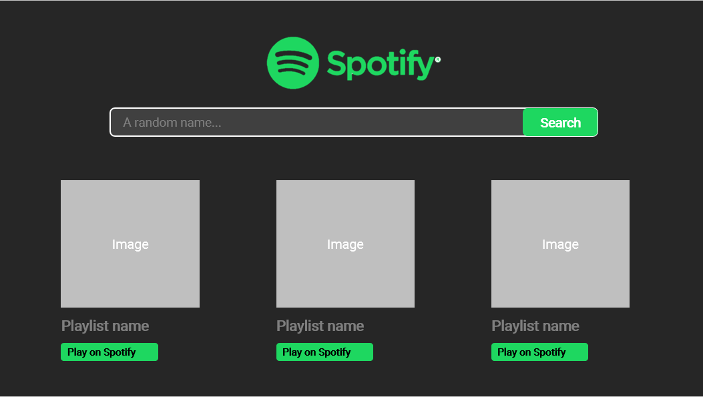

# Spotify Clone with React
> **Practice your skills**: React, HTML, CSS, client-side API requests

## TASK DESCRIPTION
Create a simple react app that searches playlists on Spotify
### The app has 3 simple functionalities:
- User input a playlist's name from spotify
- The app makes a client-side request to `Spotify API` to get the results back
- The app renders the returned results

### Required Components
> Your app can be built as creative as you can, but it should at least contains some of these essential elements
- Searchbar (Input Container + Search Button)
- Result Card, each card should contain 1 result. Each card has:
    - One large Image
    - Name of playlist 
    - Link to that playlist on Spotify
- Result Card LIST => contains all of the Result Cards

### App layout
#### Homescreen

#### Display search's results

### ATTENTION!
Your app doesn't need to be perfect. As long as it can handles all of the basic functionalities, you'd be rest assured. 
Of course, if you want to quickly level up your coding skills, you can add even more functionalities and pay more attention to your app's design.

## Finally, resources! How can I code such a thing?
### Firstly, you need to acquire a Spotify API Token
- Get your API here: https://developer.spotify.com/console/get-search-item
- Docs for SPotify Search API: https://developer.spotify.com/documentation/web-api/reference/search/search/

### But what is an API? And how to use it client-side to fetch search results?
- If you don't know much about API yet, check some resources here:
    - https://medium.freecodecamp.org/what-is-an-api-in-english-please-b880a3214a82

- To make APi requests client-side (in the browser, not in Nodejs), I would recommend to use `fetch()`:
    - https://kipalog.com/posts/Cung-tim-hieu-cach-truy-cap-tai-nguyen-voi-fetch-API
    - https://flaviocopes.com/fetch-api
    - https://developers.google.com/web/ilt/pwa/working-with-the-fetch-api
    - Use `fetch()` in REACTJS: https://blog.hellojs.org/fetching-api-data-with-react-js-460fe8bbf8f2

- Add Authorization header to your request:
    - https://stackoverflow.com/questions/49967188/using-fetch-with-authorization-header-and-cors

### Combine `fetch()` with your Reactjs skills:
- https://blog.hellojs.org/fetching-api-data-with-react-js-460fe8bbf8f2

